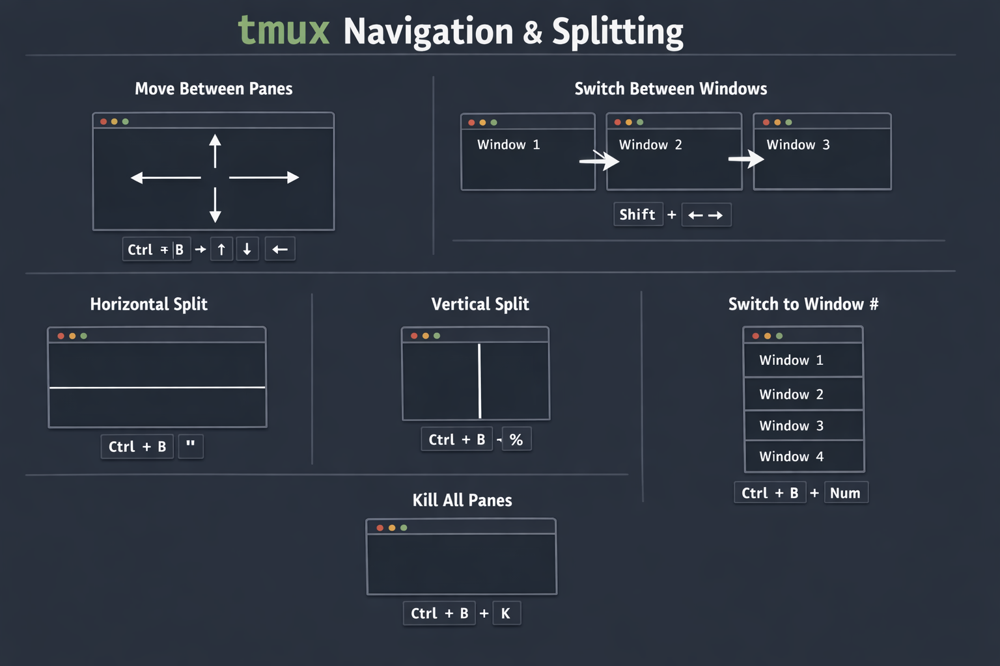

# tmux navigation and commands

A simple reference for common **tmux** key bindings and concepts.

---

## Prefix Key

All tmux commands start with the **prefix key**:

- **Ctrl + B** → command prefix

Press the keys **in order** (hold `Ctrl`, press `B`, release, then press the next key).

---

## Pane Management

Panes are splits inside a window.

- **Ctrl + B + Arrow keys** → Move between panes  
- **Ctrl + B + "** → Split current pane horizontally  
- **Ctrl + B + %** → Split current pane vertically  

---

## Window Management

Windows can contain multiple panes.

- **Ctrl + B + C** → Create a new window  
- **Ctrl + B + Number** → Switch to window by number  
- **Shift + Arrow keys** → Move between windows  

---

## Session / Process Control

- **Ctrl + B + K** → Kill all processes in all panes across all windows  

---

## tmux Structure Overview

- **Session** → Contains multiple windows  
- **Window** → Contains multiple panes  
- **Pane** → Individual terminal instances  

---

